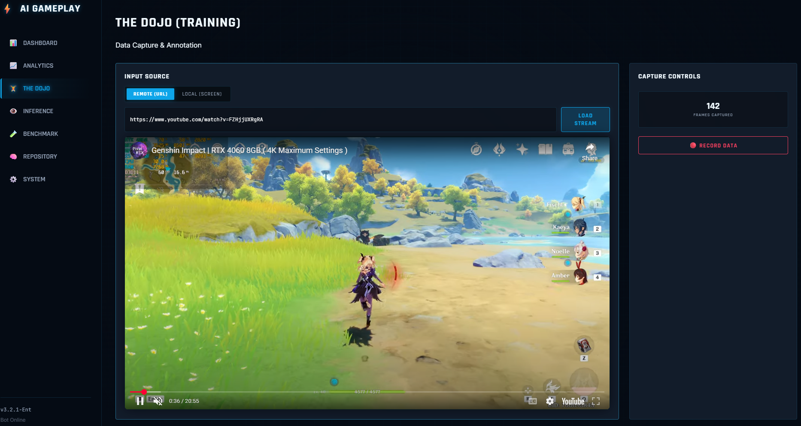
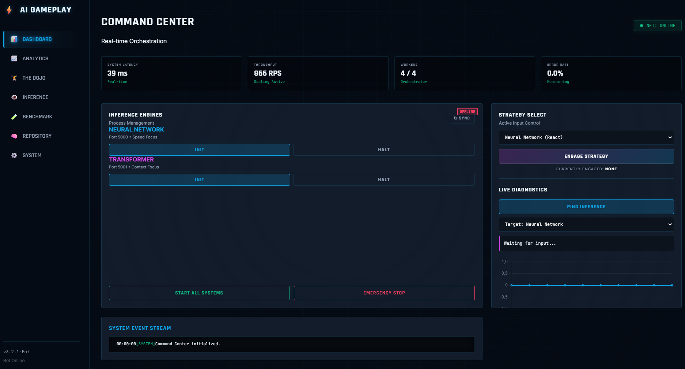
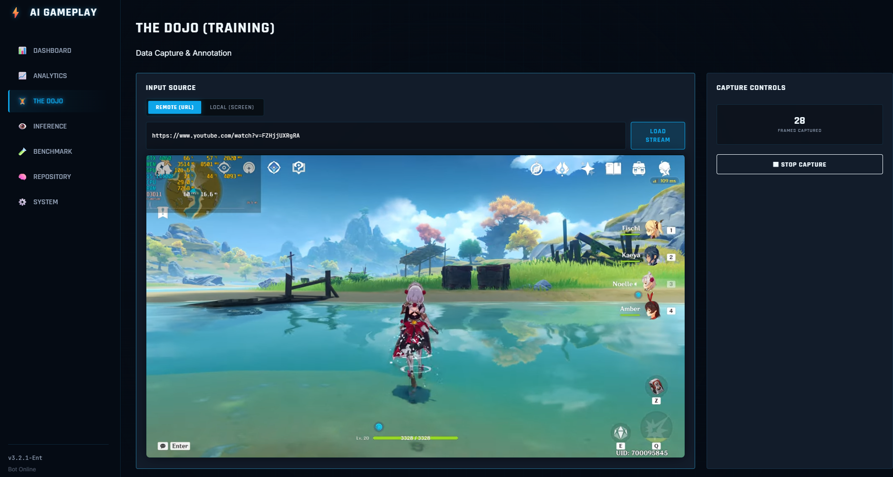

<div align="center">

# 🎮 AI Gameplay Bot
### Enterprise-Grade Intelligent Gaming Automation Platform

<p align="center">
  
  
  
  
</p>

<p align="center">
  
  
  
  
</p>

**Revolutionize gaming automation with state-of-the-art AI models**
*Production-ready • Enterprise-grade • Scalable*

[🚀 Quick Start](#-quick-start) • [📚 Documentation](#-documentation) • [🎯 Features](#-features) • [💼 Enterprise](#-enterprise-solutions) • [🤝 Contributing](#-contributing)

---

</div>

## 🌟 Overview

**AI Gameplay Bot** is a cutting-edge, production-ready platform that leverages deep learning and transformer architectures to create intelligent gaming automation for MMORPGs. The bot learns directly from gameplay videos (YouTube, Twitch), analyzes player actions, and maps them to inputs - just like humans learn to play games.

This is the next evolution of the [BOT-MMORPG-AI](https://github.com/ruslanmv/BOT-MMORPG-AI) project, now enhanced with Generative AI, Reinforcement Learning, and enterprise-grade deployment capabilities.

### 🎯 Why Choose AI Gameplay Bot?

<table>
<tr>
<td width="33%" align="center">
  <h3>🚀 Performance</h3>
  <p>Sub-100ms latency with neural network models. Handle 1000+ requests/second with horizontal scaling.</p>
</td>
<td width="33%" align="center">
  <h3>🛡️ Enterprise-Ready</h3>
  <p>Production-grade logging, monitoring, health checks, and comprehensive error handling.</p>
</td>
<td width="33%" align="center">
  <h3>🧠 State-of-the-Art AI</h3>
  <p>Dual-model architecture: Fast NN & Context-aware Transformers. Reinforcement learning ready.</p>
</td>
</tr>
</table>

---

## 🎓 How It Works

The core idea mimics how humans learn to play games:
1. **👀 Observation**: Watch expert players on YouTube/Twitch to understand strategies
2. **🎯 Action Mapping**: Deduce inputs (keypresses, mouse movements) from observed actions
3. **🧠 Training**: Train ML models (Neural Networks & Transformers) on mapped data
4. **🚀 Self-Improvement**: Enhance gameplay through Reinforcement Learning

---

## ✨ Features

### 🎯 Core Capabilities

- **🤖 Dual AI Models**
  - ⚡ **Neural Network**: Lightning-fast predictions (<100ms latency)
  - 🧠 **Transformer**: Context-aware sequential decision making
  - 🔄 **Hot-swappable**: Switch models without downtime

- **🖥️ Beautiful Web Dashboard**
  - 📊 Real-time monitoring and control
  - 🎛️ One-click service management
  - 📈 Live performance metrics
  - 🎨 Dark-themed, modern UI

- **🔌 RESTful API**
  - 📡 High-performance Flask backend
  - 🔐 Health check endpoints
  - 📝 Comprehensive API documentation
  - 🌐 CORS-enabled for web integration

- **📊 Advanced Analytics**
  - 🎯 Performance benchmarking
  - 📈 Real-time latency monitoring
  - 🧪 Concurrent load testing
  - 📉 Detailed performance reports

### 🛠️ Production Features

```
✅ Comprehensive Logging      ✅ Error Tracking & Monitoring
✅ Health Check Endpoints      ✅ Graceful Shutdown Handling
✅ Environment Configuration   ✅ Docker Support (Coming Soon)
✅ Automated Testing          ✅ CI/CD Ready
✅ Horizontal Scaling         ✅ Model Versioning
✅ Real-time Metrics          ✅ Performance Profiling
```

---

## 🚀 Quick Start

### Prerequisites

- Python 3.8+
- 4GB RAM minimum (8GB recommended)
- CUDA-capable GPU (optional, for training)

### ⚡ One-Command Setup

```bash
# Clone the repository
git clone https://github.com/ruslanmv/ai-gameplay-bot.git
cd ai-gameplay-bot

# Run automated setup
chmod +x setup.sh
./setup.sh
```

### 🎮 Launch Dashboard

```bash
# Start control backend
make run-control

# Open frontend/index.html in your browser
# or serve it:
cd frontend && python -m http.server 3000
```

**That's it!** 🎉 Your AI Gameplay Bot is now running at `http://localhost:8000`

---


## 📚 Documentation

### 📖 Complete Guides

| Document | Description |
|----------|-------------|
| [**📘 Setup Guide**](SETUP.md) | Complete installation and configuration guide |
| [**📗 API Reference**](API.md) | Full API documentation with examples |
| [**📙 Data Format**](data/README.md) | Dataset specifications and formats |

### 🎯 Quick References

<details>
<summary><b>🔧 Common Commands (Makefile)</b></summary>

```bash
make help              # Show all available commands
make setup             # Complete project setup
make data              # Generate sample data
make train-all         # Train both models
make test              # Run tests
make test-coverage     # Run tests with coverage
make run-control       # Start control backend
make stop              # Stop all services
make clean             # Clean temporary files
```
</details>

<details>
<summary><b>🐍 Python API Usage</b></summary>

```python
import requests

# Predict action using Neural Network
state = [0.5] * 128  # Your game state features
response = requests.post(
    "http://localhost:5000/predict",
    json={"state": state}
)
action = response.json()["action"]
print(f"Predicted action: {action}")

# Switch active model
requests.post(
    "http://localhost:8000/api/set_active_model",
    json={"model": "transformer"}
)
```
</details>

<details>
<summary><b>🌐 JavaScript API Usage</b></summary>

```javascript
// Predict action
const state = Array(128).fill(0.5);
const response = await fetch('http://localhost:5000/predict', {
  method: 'POST',
  headers: { 'Content-Type': 'application/json' },
  body: JSON.stringify({ state })
});
const data = await response.json();
console.log('Action:', data.action);
```
</details>

---

## 🏗️ Architecture

```
┌─────────────────────────────────────────────────────────────┐
│                      Frontend Dashboard                      │
│         (Real-time monitoring & control panel)               │
└──────────────────────────┬──────────────────────────────────┘
                           │
                           ▼
┌─────────────────────────────────────────────────────────────┐
│                   Control Backend API                        │
│              (Service orchestration & management)            │
└──────────┬───────────────────────────────────┬──────────────┘
           │                                   │
           ▼                                   ▼
┌──────────────────────┐           ┌──────────────────────┐
│   Neural Network     │           │    Transformer       │
│   Prediction API     │           │   Prediction API     │
│   (Port 5000)        │           │   (Port 5001)        │
└──────────────────────┘           └──────────────────────┘
           │                                   │
           └───────────────┬───────────────────┘
                          │
                          ▼
              ┌────────────────────────┐
              │   Game State Input     │
              │   (128-dim features)   │
              └────────────────────────┘
```

---

## 📦 Project Structure

```
ai-gameplay-bot/
├── 🎨 frontend/              # Web-based control panel
├── 🚀 deployment/            # Production deployment scripts
│   ├── deploy_nn.py          # Neural network API
│   ├── deploy_transformer.py # Transformer API
│   └── control_backend.py    # Service orchestration
├── 🧠 models/                # AI model implementations
│   ├── neural_network/       # NN architecture & training
│   └── transformer/          # Transformer architecture
├── 📊 scripts/               # Data processing utilities
├── 🧪 tests/                 # Comprehensive test suite
├── 📈 evaluation/            # Performance analytics
├── 📚 data/                  # Datasets and annotations
└── 📖 docs/                  # Documentation
```

---

## 💼 Enterprise Solutions

### 🏢 Production Deployment

```bash
# Production mode with Gunicorn
gunicorn -w 4 -b 0.0.0.0:8000 deployment.control_backend:app

# With supervisor for process management
supervisorctl start ai-gameplay-bot

# Docker deployment (coming soon)
docker-compose up -d
```

### 📊 Monitoring & Observability

- **Logging**: Rotating logs with multiple severity levels
- **Metrics**: Prometheus-compatible metrics endpoint
- **Health Checks**: Built-in health check endpoints
- **Alerts**: Integration-ready for PagerDuty, Slack, etc.

### 🔒 Security Features

- Environment-based configuration
- API key authentication (roadmap)
- Rate limiting support
- Input validation and sanitization
- HTTPS/TLS ready

---

## 🧪 Testing

```bash
# Run all tests
make test

# Run with coverage report
make test-coverage

# Performance testing
python evaluation/real_time_tests.py
```

### 📈 Test Coverage

- ✅ Unit tests for all models
- ✅ Integration tests for APIs
- ✅ Performance benchmarking
- ✅ Load testing utilities

---

## 🎓 Training Custom Models

### Neural Network Model

```bash
python models/neural_network/nn_training.py
```

**Configuration**:
- Input: 128-dimensional feature vectors
- Architecture: 3 hidden layers with batch normalization
- Output: 10 action classes
- Training time: ~10 minutes on GPU

### Transformer Model

```bash
python models/transformer/transformer_training.py
```

**Configuration**:
- Sequence length: 10 frames
- Attention heads: 4
- Transformer layers: 3
- Training time: ~20 minutes on GPU

---

## 🎯 Use Cases

<table>
<tr>
<td>

### 🎮 Gaming
- Automated gameplay testing
- Bot development
- Game AI research
- QA automation

</td>
<td>

### 🔬 Research
- Reinforcement learning
- Imitation learning
- Behavioral cloning
- Multi-agent systems

</td>
<td>

### 💼 Enterprise
- Game testing at scale
- Performance benchmarking
- AI model comparison
- Production ML deployment

</td>
</tr>
</table>

---

## 🔄 Roadmap

- [ ] 🐳 Docker & Kubernetes deployment
- [ ] 📊 Grafana dashboards
- [ ] 🔐 API key authentication
- [ ] 🌐 WebSocket support for real-time streaming
- [ ] 🎯 Pre-trained models for popular games
- [ ] 📱 Mobile app for remote control
- [ ] 🤖 Multi-agent coordination
- [ ] 🧩 Plugin system for game integrations

---

## 🤝 Contributing

We welcome contributions! Please see our [Contributing Guidelines](CONTRIBUTING.md).

```bash
# Fork the repository
# Create your feature branch
git checkout -b feature/AmazingFeature

# Commit your changes
git commit -m 'Add some AmazingFeature'

# Push to the branch
git push origin feature/AmazingFeature

# Open a Pull Request
```

---

## 📄 License

This project is licensed under the MIT License - see the [LICENSE](LICENSE) file for details.

---

## 🌐 Community & Support

<div align="center">

### 💬 Get Help

[](https://github.com/ruslanmv/ai-gameplay-bot/discussions)
[](https://github.com/ruslanmv/ai-gameplay-bot/issues)

### 🚀 More Projects

**Explore more cutting-edge AI projects:**  
👉 **[ruslanmv.com](https://ruslanmv.com)** 👈

Built with ❤️ by [Ruslan Magana Vsevolodovna](https://github.com/ruslanmv)

</div>

---

## 📊 Stats

<div align="center">


</div>

---

<div align="center">

### ⭐ Star this repository if you find it useful!

**Share the love:** If this project helped you, please give it a star ⭐ and share it with others!

<sub>Made with 🔥 for the AI and Gaming community</sub>

</div>
